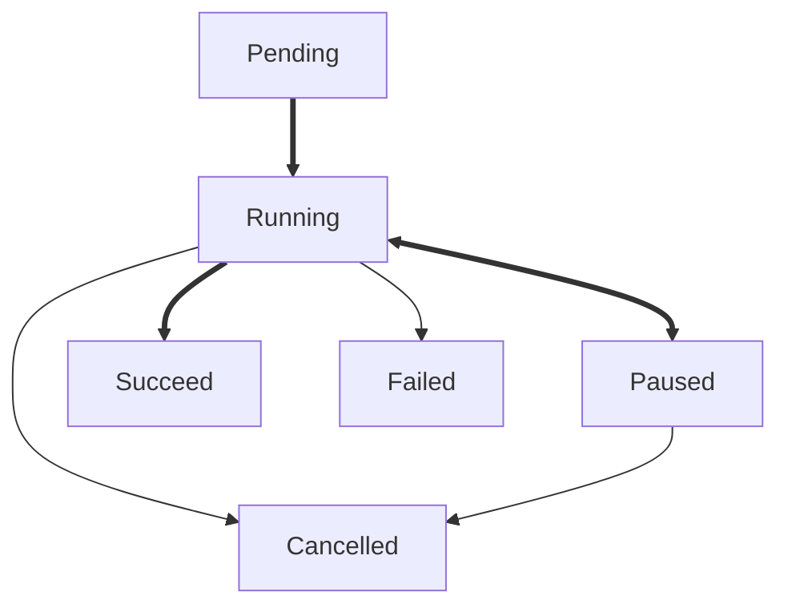

# Tuzk

[](https://github.com/Leawind/tuzk-ts)
[](https://jsr.io/@leawind/tuzk)
[](https://jsr.io/@leawind/tuzk/doc)
[](https://github.com/Leawind/tuzk-ts/actions/workflows/deno-test.yaml)

Tuzk is a library for managing asynchronous tasks with progress tracking and error handling.

## Features

- **Task Management**: Run, pause, resume, and cancel tasks with intuitive APIs.
- **Progress Tracking**: Track task progress with checkpoint markers and percentage-based updates.
- **Error Handling**: Handle task errors with custom error types and centralized error reporting.
- **Concurrency Support**: Combine multiple tasks using `Tuzk.all()` and `Tuzk.parallel()`. Or Control concurrency with `TuzkManager`.

## Installation

```bash
npm install @leawind/tuzk
```

## Usage

### Basic Task

Create and run a simple task:

```typescript
import { Tuzk } from '@leawind/tuzk';

const task = new Tuzk<number>(async (tuzk) => {
	let sum = 0;
	for (let i = 1; i <= 100; i++) {
		sum += i;
		await tuzk.checkpoint(i / 100); // Update progress
	}
	return sum;
});

assert(task.stateIs('pending'));
const result = await task.run();
assert(task.stateIs('success'));

assert(result === 5050);
```

### Task Management with TuzkManager

Manage multiple tasks with controlled concurrency:

```typescript
import { Tuzk, TuzkManager } from '@leawind/tuzk';

const manager = new TuzkManager(3); // Max 3 concurrent tasks

for (let i = 0; i < 10; i++) {
	manager.submit(async () => {
		await new Promise((r) => setTimeout(r, 100));
		return i;
	});
}

await manager.waitForAll();
```

### Task Control

#### Pause/Resume

```typescript
import { Tuzk } from '@leawind/tuzk';

const task = new Tuzk(async (tuzk) => {
	for (let i = 0; i < 100; i++) {
		await tuzk.checkpoint(i / 100);
	}
});

// Start the task
const promise = task.run();

// Pause after some time
setTimeout(() => {
	task.pause();
}, 500);

// Resume after some time
setTimeout(() => {
	task.resume();
}, 1000);

// Wait for completion
await promise;
```

#### Cancel

```typescript
import { Tuzk } from '@leawind/tuzk';

const task = new Tuzk(async (tuzk) => {
	await tuzk.checkpoint(0.5);
});

// Start the task
const promise = task.run();

// Cancel after some time
setTimeout(() => {
	task.cancel();
}, 300);

try {
	await promise;
} catch (error) {
	console.log('Task was cancelled');
}
```

#### Combine

```typescript
import { Tuzk } from '@leawind/tuzk';

const tasks = [
	new Tuzk(async (tuzk) => {
		await tuzk.checkpoint(0.5);
		return 1;
	}),
	new Tuzk(async (tuzk) => {
		await tuzk.checkpoint(0.5);
		return 2;
	}),
];

const allTasks = Tuzk.all(tasks);
const results = await allTasks.run();

console.log(results); // [1, 2]
```

#### Race

```typescript
import { Tuzk } from '@leawind/tuzk';

const tasks = [
	new Tuzk(async () => 'slow'),
	new Tuzk(async () => 'fast'),
];

const raceTask = Tuzk.race(tasks);
const result = await raceTask.run();

console.log(result); // 'fast'
```

## Task State Diagram


