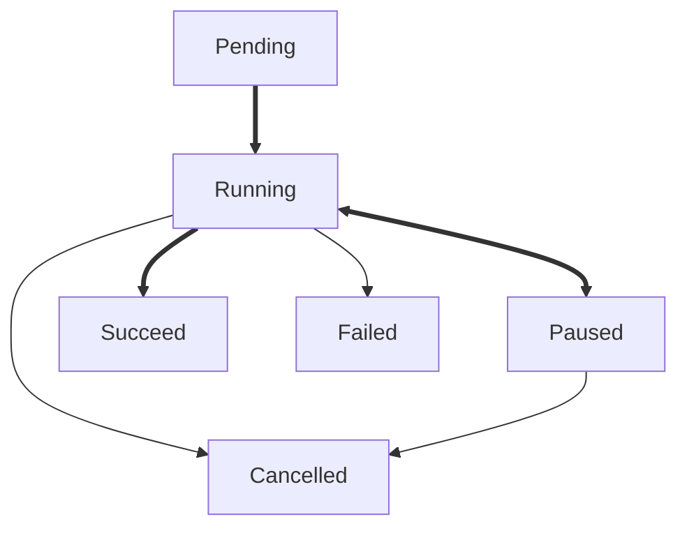

# Tuzk

[](https://github.com/Leawind/tuzk-ts)
[](https://jsr.io/@leawind/tuzk)
[](https://jsr.io/@leawind/tuzk/doc)
[](https://github.com/Leawind/tuzk-ts/actions/workflows/deno-test.yaml)

Tuzk is a library for managing asynchronous tasks with progress tracking.

## Features

- **Task Management**: Run, pause, resume, and cancel tasks.
- **Progress Tracking**: Track the progress of tasks.
- **Error Handling**: Handle task errors, including custom error types for specific scenarios.

## Usage

Here are some simple examples of how to use Tuzk:

### Basic Task

```typescript
import { Tuzk } from '@leawind/tuzk';

const task = new Tuzk<number>(async (tuzk) => {
	let sum = 0;
	for (let i = 1; i <= 100; i++) {
		sum += i;
		await tuzk.checkpoint(i / 100);
	}
	return sum;
});

assert(task.stateIs('pending'));
const result = await task.run();
assert(task.stateIs('success'));

assert(result === 5050);
```

### Combine all tasks

```typescript
import { Tuzk } from '@leawind/tuzk';

const tuzks: Tuzk<void>[] = [
	new Tuzk(async (tuzk) => await tuzk.checkpoint(0.5)),
	new Tuzk(async (tuzk) => await tuzk.checkpoint(0.5)),
];

const tuzkAll = Tuzk.all(tuzks);

// It auto runs all subtasks
await tuzkAll.run();
// It only succeeds when all subtasks succeed

assert(tuzks[0].stateIs('success'));
assert(tuzks[1].stateIs('success'));

assert(tuzkAll.stateIs('success'));
```

## Task State Diagram


