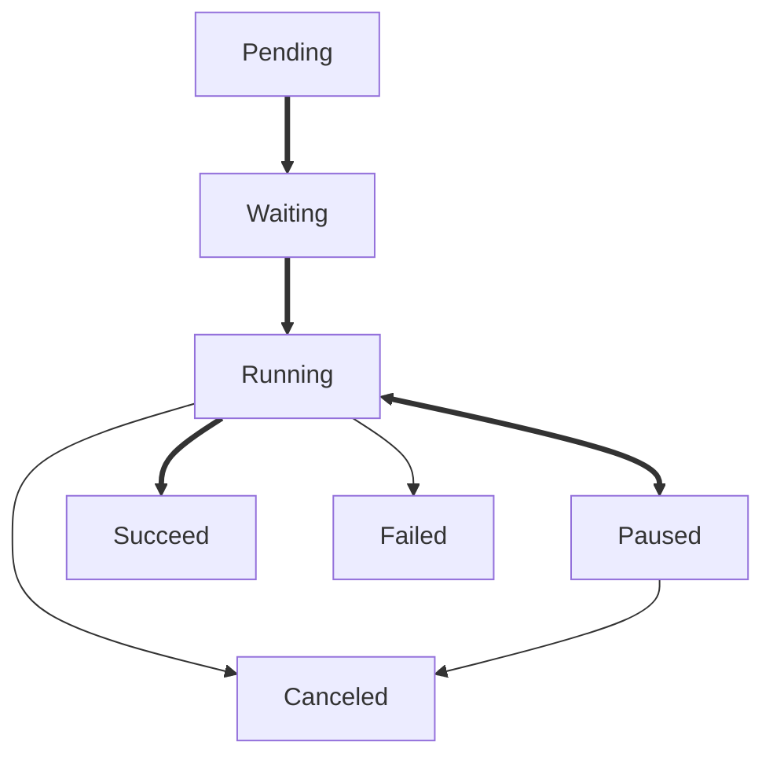

# Tuzk

[](https://github.com/Leawind/tuzk-ts)
[](https://jsr.io/@leawind/tuzk)
[](https://jsr.io/@leawind/tuzk/doc)
[](https://github.com/Leawind/tuzk-ts/actions/workflows/deno-test.yaml)

Tuzk is a library for managing asynchronous tasks with support for dependencies and progress tracking.

## Features

- **Task Management**: Start, pause, resume, and cancel tasks.
- **Dependencies**: Define dependencies between tasks, ensuring tasks only start when their dependencies are completed.
- **Progress Tracking**: Track the progress of tasks.
- **Error Handling**: Handle task errors, including custom error types for specific scenarios.

## Usage

Here is a basic example of how to use Tuzk:

```typescript
import { Tuzk, TuzkState } from '@leawind/tuzk';

const task = new Tuzk(async (checkPoint) => {
	for (let i = 0; i <= 100; i++) {
		await checkPoint(i / 100);
		// Simulate some work
		await new Promise((resolve) => setTimeout(resolve, 20));
	}
	return 'Task Completed';
});

task.onProgressUpdated.addListener((progress) => {
	console.log(`Progress: ${progress * 100}%`);
});

task.onStateUpdated.addListener((state) => {
	console.log(`State: ${TuzkState[state]}`);
});

task.start()
	.then((result) => console.log(result))
	.catch((error) => console.error(error));
```

## Task State Diagram


