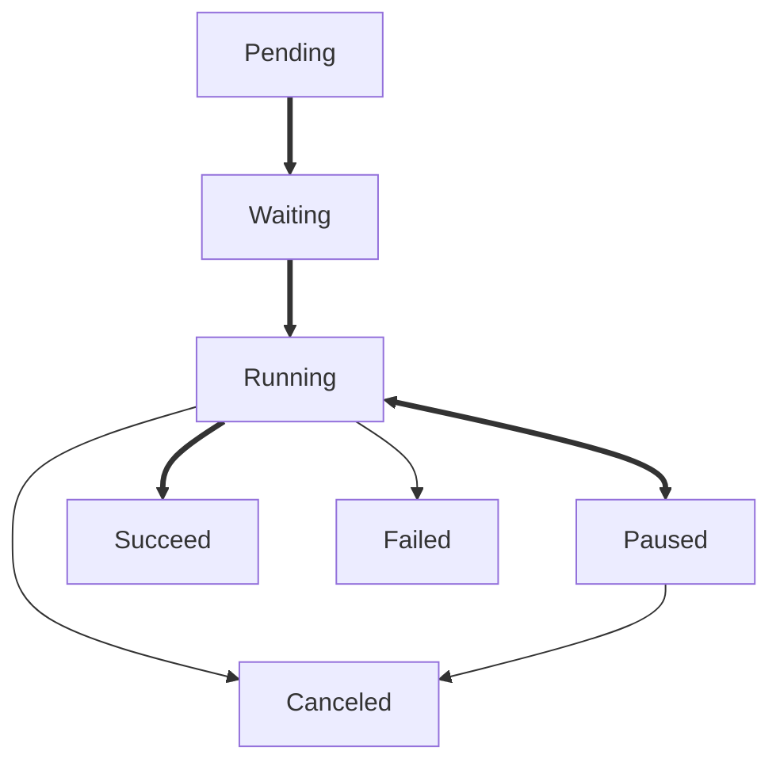

# Tuzk

[](https://github.com/Leawind/tuzk-ts)
[](https://jsr.io/@leawind/tuzk)
[](https://jsr.io/@leawind/tuzk/doc)
[](https://github.com/Leawind/tuzk-ts/actions/workflows/deno-test.yaml)

Tuzk is a library for managing asynchronous tasks with support for dependencies and progress tracking.

## Features

- **Task Management**: Start, pause, resume, and cancel tasks.
- **Dependencies**: Define dependencies between tasks, ensuring tasks only start when their dependencies are completed.
- **Progress Tracking**: Track the progress of tasks.
- **Error Handling**: Handle task errors, including custom error types for specific scenarios.

## Usage

Here are some simple examples of how to use Tuzk:

### Basic Task

```typescript
import { Tuzk, TuzkState } from '@leawind/tuzk';

const task = new Tuzk<number>(async (tuzk) => {
	let sum = 0;
	for (let i = 1; i <= 100; i++) {
		sum += i;
		await tuzk.checkpoint(i / 100);
	}
	return sum;
});

assert(task.getState() === TuzkState.Pending);
const result = await task.start();
assert(task.getState() === TuzkState.Success);

assert(result === 5050);
```

### Task with Dependency

```typescript
import { Tuzk, TuzkState } from '@leawind/tuzk';

const tuzk1: Tuzk<void> = new Tuzk(async (tuzk) => await tuzk.checkpoint(0.5));
const tuzk2: Tuzk<void> = new Tuzk(async (tuzk) => await tuzk.checkpoint(0.5));

tuzk2.addDependency(tuzk1);

tuzk1.start(); // You need to manually start the dependency
await tuzk2.start();

assert(tuzk1.stateIs(TuzkState.Success));
assert(tuzk2.stateIs(TuzkState.Success));
```

### Combine all tasks

```typescript
import { Tuzk, TuzkState } from '@leawind/tuzk';

const tuzks: Tuzk<void>[] = [
	new Tuzk(async (tuzk) => await tuzk.checkpoint(0.5)),
	new Tuzk(async (tuzk) => await tuzk.checkpoint(0.5)),
];

const tuzkAll = Tuzk.all(tuzks);

// It auto starts all subtasks
await tuzkAll.start();
// It only succeeds when all subtasks succeed

assert(tuzks[0].stateIs(TuzkState.Success));
assert(tuzks[1].stateIs(TuzkState.Success));

assert(tuzkAll.stateIs(TuzkState.Success));
```

## Task State Diagram


